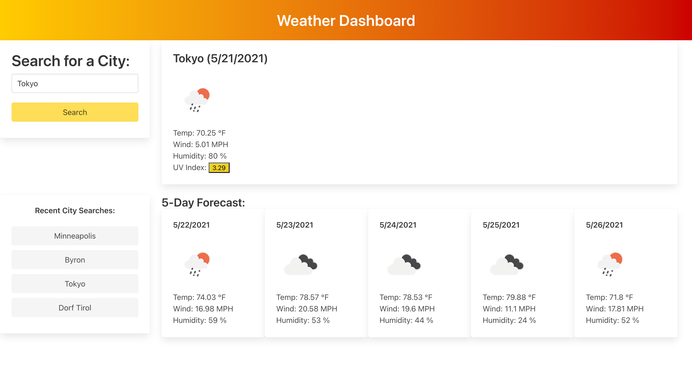

# Weather Dashboard Application

## Description

This is a simple weather application. It was built in order to give users a way to check the weather and forecast for a specific city of their choice. It utilizes the OpenWeather API to provide up-to-date data and predictions. Additionally, it stores previous searches so that users can easily return to the weather predictions for cities. 

## Installation

This weather application has been deployed to a GitHub pages site (accessible [here](https://msteblu.github.io/WeatherDashboard/)), where users can interact with it and look up the weather. 

All of the components of the application are also available through a download and clone.

## Usage

Navigate either to the GitHub [site](https://msteblu.github.io/WeatherDashboard/) or open the index.html file in a browser. Plan out your day by checking the weather. Input a city name and check the current weather and the 5-day forecast for that city. 

## Credits

 [OpenWeather (TM)](https://openweathermap.org/) is the provider for weather data for this application (through API use).

## License

Licensed under the [MIT](https://github.com/microsoft/vscode/blob/main/LICENSE.txt) license. 